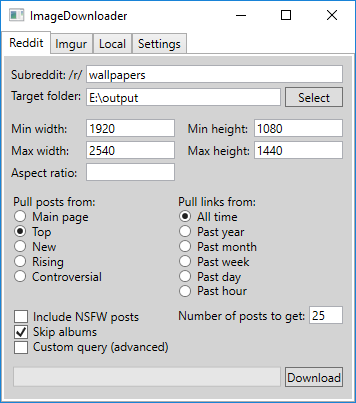

# ImageDownloader

ImageDownloader provides a way to filter images by specifying a minimum and maximum resolution.

## Features
ImageDownloader supports downloading and filtering images originating from Reddit and Imgur, as well as images located in local directories. The user can specify a maximum and minimum resolution that images from all supported sources must fit. Exact resolutions can be specified by choosing identical minimum and maximum requirements.

The following image sources are supported:
* Imgur albums and account profiles.
* Reddit posts can be sourced from any subreddit, with additional filtering options. Posts linking to i.redd.it, DeviantArt, or Imgur images are explicitly supported, as well as Imgur albums. An attempt is made at downloading any other image linked to, if the url ends in one of the whitelisted image extensions.
* Files in local directories can also be filtered. Images that adhere to the resolution requirements are copied into the destination folder, without modifying the original files.

When posts are grabbed from Reddit, the following additional options are supported:
* You can specify to pull posts from the main subreddit page, or from other tabs such as _new_ or _top_.
* It is possible to specify whether to include posts marked NSFW in the results.
* Links to Imgur albums are parsed and will apply the resolution-filter to all images in that album. It is possible to skip these Imgur albums if so desired.
* The user can specify how many posts to pull, which will automatically page through the reddit posts using the `&after` and `&count` api parameters. This option is currently limited to 1000 posts.

## Usage

To download any number of Reddit posts from a specific subreddit, simply specify the subreddit, the output folders, and optionally add filters.

The following UI example will download images from the top 25 posts of all time from the _wallpapers_-subreddit, provided that the image resolution is between 1920x1080 - 2540x1440, that the post doesn't link to an album, and that the post hasn't been marked NSFW:

## License
Copyright (c) 2017 Marcus Winding Quistgaard. Released under the [MIT license](LICENSE).